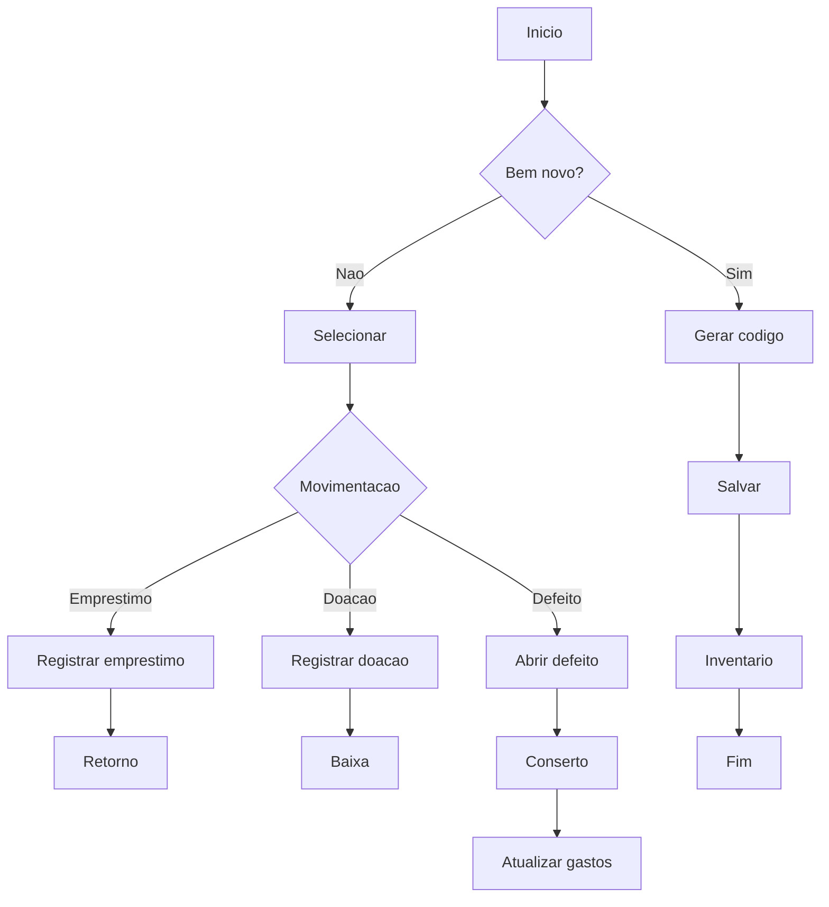

```mermaid
flowchart TD
  A[Inicio] --> B{Bem novo?}
  B -- Sim --> C[Gerar codigo]
  C --> D[Salvar]
  D --> E[Inventario]
  B -- Nao --> F[Selecionar]
  F --> G{Movimentacao}
  G -->|Emprestimo| H[Registrar emprestimo]
  G -->|Doacao| I[Registrar doacao]
  G -->|Defeito| J[Abrir defeito]
  H --> K[Retorno]
  I --> L[Baixa]
  J --> M[Conserto]
  M --> N[Atualizar gastos]
  E --> Z[Fim]
```

