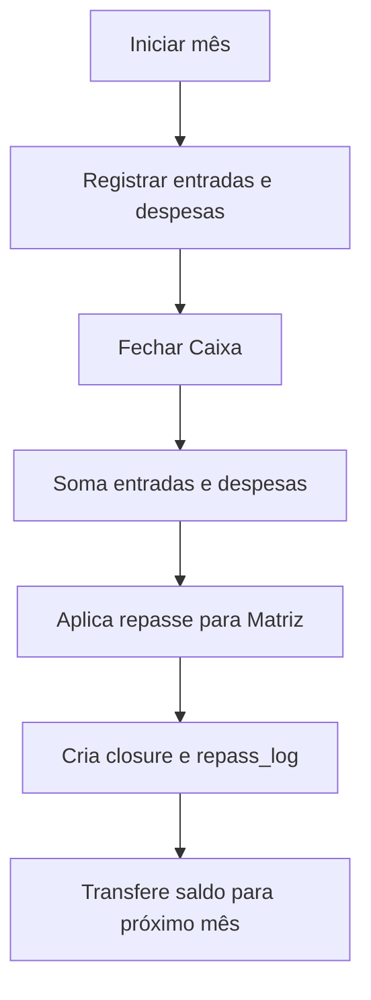
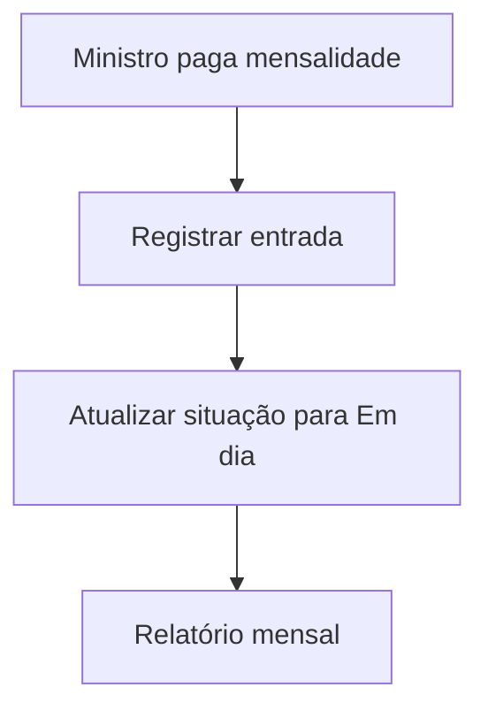
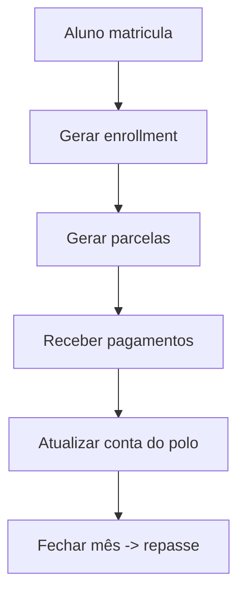

# Tesouraria — Fluxos (Mermaid)

## Fechamento de Caixa (Igreja)

```mermaid
flowchart TD
  A[Iniciar mês] --> B[Registrar entradas e despesas]
  B --> C[Fechar Caixa]
  C --> D[Soma entradas e despesas]
  D --> E[Aplica repasse para Matriz]
  E --> F[Cria closure e repass_log]
  F --> G[Transfere saldo para próximo mês]
```

## Mensalidade (Convenção)

```mermaid
flowchart TD
  A[Ministro paga mensalidade] --> B[Registrar entrada]
  B --> C[Atualizar situação para Em dia]
  C --> D[Relatório mensal]
```

## Venda de Curso / Parcelamento (Faculdade EAD)

```mermaid
flowchart TD
  A[Aluno matricula] --> B[Gerar enrollment]
  B --> C[Gerar parcelas]
  C --> D[Receber pagamentos]
  D --> E[Atualizar conta do polo]
  E --> F[Fechar mês -> repasse]
```

